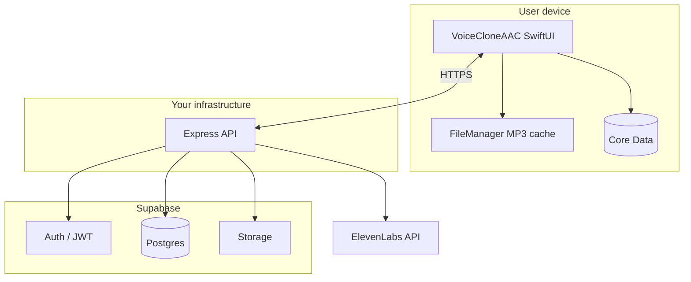
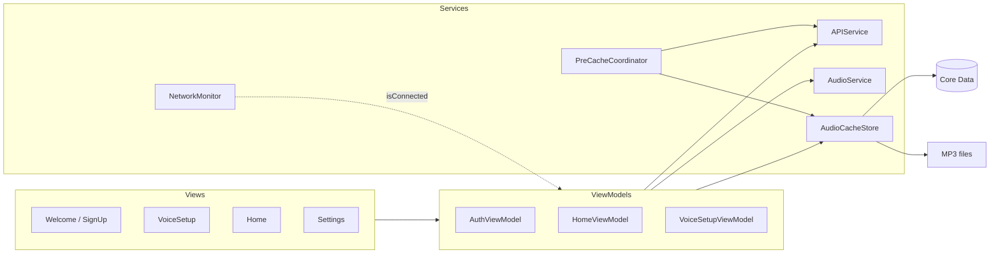
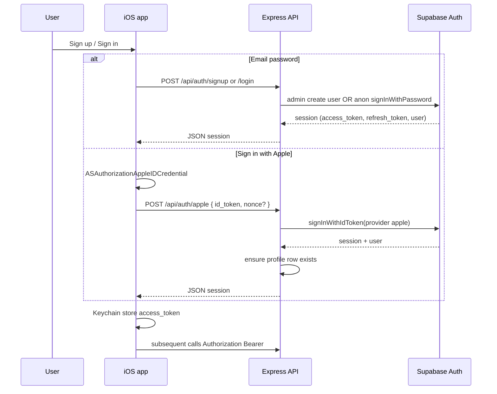
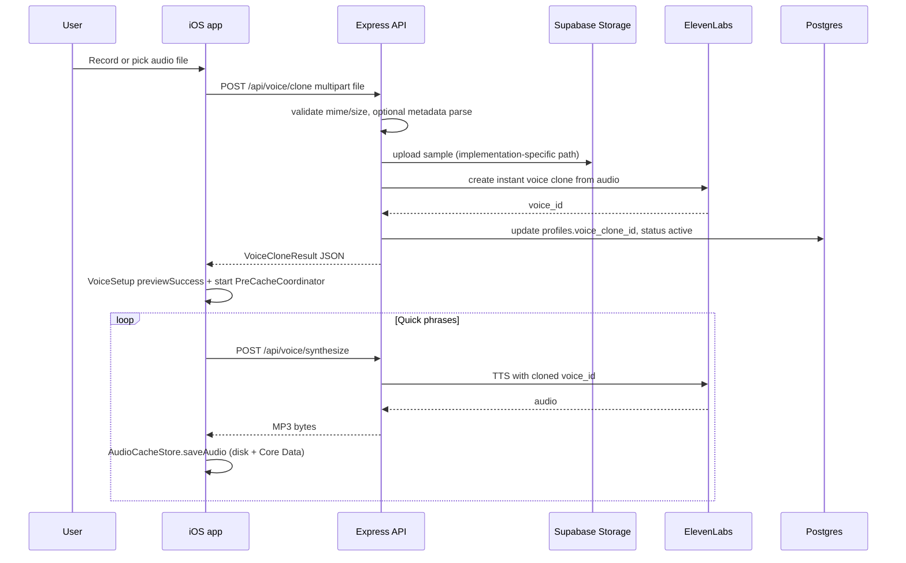
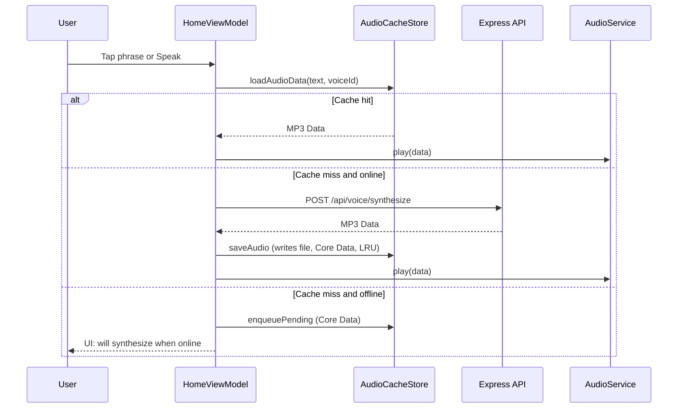
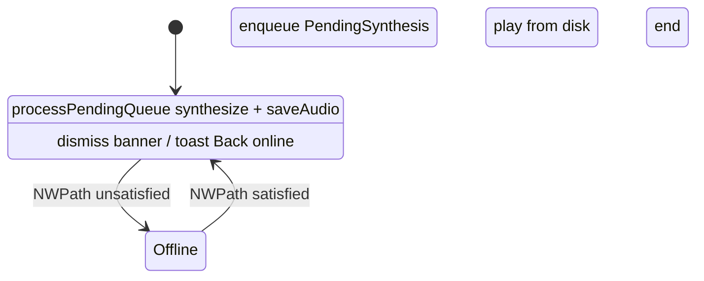
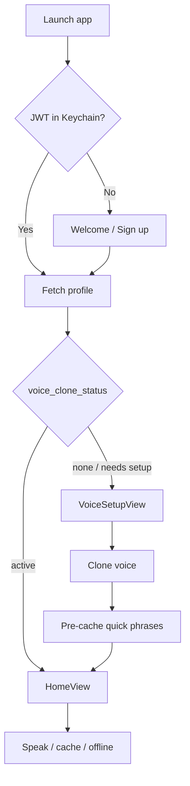

# Architecture and flows — VoiceClone AAC

Technical overview of the **iOS client**, **Express backend**, **Supabase**, and **ElevenLabs**, with **sequence diagrams** for the main user journeys.

---

## 1. System context

**Trust boundaries**

- The **JWT** never leaves the device except as `Authorization` to your API.
- **Service role** and **ElevenLabs** keys exist only on the server.

---

## 2. iOS app layers (logical)

| Component | Responsibility |
|-----------|----------------|
| **APIService** | Async HTTP to Express; JWT from Keychain |
| **AudioCacheStore** | Save/load MP3 by phrase hash; pending queue; LRU; totals |
| **NetworkMonitor** | `NWPathMonitor` → published online/offline |
| **PreCacheCoordinator** | After clone success, batch-fetch quick phrases into cache |
| **PersistenceController** | `NSPersistentContainer` for `VoiceCloneCache` model |

---

## 3. Authentication flow (email or Apple)

After login, **AuthViewModel** loads **profile** (`GET /api/profile`) for `voiceCloneId` and routing (onboarding vs home).

---

## 4. Voice clone flow

**Stale voice handling:** when the active `voiceCloneId` changes, the app can **purge** cache rows for other voice IDs (`purgeStaleVoiceCaches`).

---

## 5. Speak / synthesize flow (online, with cache)

**File naming:** `{SHA256(normalized_text)}.mp3` under Application Support, keyed in **CachedAudio** by `textHash` + `voiceId`.

---

## 6. Offline queue and reconnect

- **PendingSynthesis** stores normalized text, category, `createdAt`, `status` (`pending` | `failed`).
- On reconnect, **HomeView** triggers **processPendingQueue** (sequential synthesize + delete pending row).

---

## 7. Data stores

### Postgres (Supabase)

| Table | Role |
|-------|------|
| `profiles` | `display_name`, `voice_clone_id`, `voice_clone_status` |
| `phrases` | User phrase library, categories, `last_used_at` |
| `voice_samples` | Metadata / URLs for uploaded samples |

RLS policies scope rows to `auth.uid()` for direct client access; the **API uses service role** and still enforces `req.userId` from JWT.

### Core Data (device)

| Entity | Role |
|--------|------|
| **CachedAudio** | `text`, `textHash`, `localFilePath`, `voiceId`, `fileSize`, timestamps |
| **PendingSynthesis** | Offline queue rows |

### Disk

- MP3 files in app sandbox (Application Support subdirectory), excluded from iCloud unless you change file URLs.

---

## 8. Backend route mounting

Express mounts:

- `/health` — public
- `/api/auth/*` — auth router
- `/api/profile`, `/api/phrases`, `/api/voice/*` — authenticated routers (see `app.ts`)

Global middleware: helmet, CORS, JSON body limit, API rate limiter, centralized error handler.

---

## 9. Diagram: end-to-end “first launch”

---

## 10. Further reading

- Environment and API tables: **[SETUP_ENV_AND_STATUS.md](./SETUP_ENV_AND_STATUS.md)**
- Product/planning notes: **[VoiceClone-AAC-Architecture-Plan.md](./VoiceClone-AAC-Architecture-Plan.md)**
