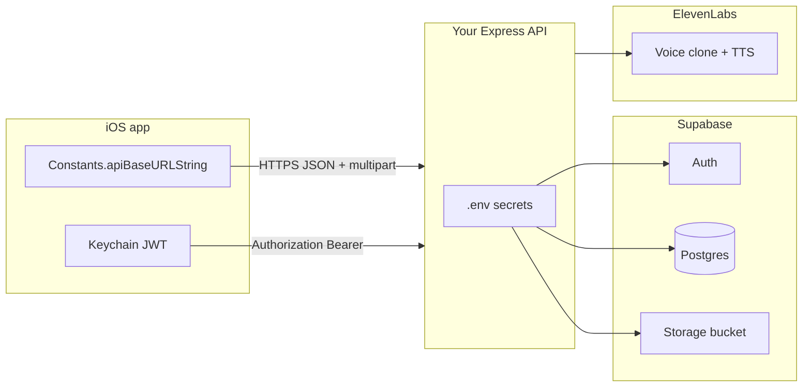

# Setup: environment variables, APIs, and project status

This document explains **how to wire configuration**, **which services provide which APIs**, and **what is left to build or harden** for a production rollout.

---

## 1. Configuration map (who talks to whom)



| Client | Variable / setting | Where it lives | Purpose |
|--------|-------------------|----------------|---------|
| **iOS** | `apiBaseURLString` | `VoiceCloneAAC/Utilities/Constants.swift` | Base URL for all REST calls (`/api/...`) |
| **iOS** | *(none for Supabase URL in app)* | — | App talks only to **your** backend; backend talks to Supabase |
| **Backend** | `SUPABASE_URL` | Railway/host env + `backend/.env` | Supabase project URL |
| **Backend** | `SUPABASE_ANON_KEY` | Same | Public anon key (used for password login / token exchange paths) |
| **Backend** | `SUPABASE_SERVICE_ROLE_KEY` | Same | **Secret** — admin client for profiles, storage, user creation |
| **Backend** | `ELEVENLABS_API_KEY` | Same | ElevenLabs REST API |
| **Backend** | `SUPABASE_VOICE_BUCKET` | Same | Storage bucket name (default `voiceclone-aac`) |
| **Backend** | `PORT` | Optional (default `3000`) | Listen port |
| **Backend** | `NODE_ENV` | Optional | `development` / `production` |
| **Backend** | `CORS_ORIGINS` | Optional | Comma-separated allowed origins, or `*` (dev only) |

Copy from **`backend/.env.example`** to **`backend/.env`** and fill in real values.

---

## 2. Where to get each value

### Supabase

1. Create a project at [supabase.com](https://supabase.com).
2. **Project URL** → `SUPABASE_URL` (e.g. `https://xxxx.supabase.co`).
3. **Settings → API**:
   - `anon` **public** key → `SUPABASE_ANON_KEY`
   - `service_role` **secret** key → `SUPABASE_SERVICE_ROLE_KEY` (never ship to the app)
4. Run **`supabase/migrations/20260422120000_voiceclone_schema.sql`** in the SQL editor (or via CLI).
5. **Storage**: create bucket `voiceclone-aac` (or your chosen name matching `SUPABASE_VOICE_BUCKET`). Adjust bucket policies for your threat model (private + signed URLs vs public read).
6. **Auth → Providers**:
   - Enable **Email** for email/password flows.
   - Enable **Apple** for Sign in with Apple: add Services ID, secret key, bundle ID, and redirect URLs per Supabase docs. The iOS app uses native `ASAuthorization`; the backend verifies the Apple `id_token` via `anon.auth.signInWithIdToken`.

### ElevenLabs

1. Account at [elevenlabs.io](https://elevenlabs.io).
2. **API key** → `ELEVENLABS_API_KEY`.
3. Ensure your plan supports **instant voice clone** (IVC) and **text-to-speech** on the voice IDs you create. The backend integrates with ElevenLabs in `backend/src/lib/elevenlabs.ts`.

### iOS app base URL

1. Deploy the Express app (e.g. Railway) and note the HTTPS origin.
2. Set **`Constants.apiBaseURLString`** to that origin **without** a trailing slash.
3. If you use a custom domain or staging, use build configurations or `.xcconfig` later to avoid editing Swift by hand.

---

## 3. HTTP API reference (backend)

All authenticated routes expect:

```http
Authorization: Bearer <access_token>
```

The token is the **Supabase JWT** returned by your API on signup/login/Apple sign-in.

Base path: `{apiBaseURL}` (e.g. `https://api.example.com`).

| Method | Path | Auth | Description |
|--------|------|------|-------------|
| GET | `/health` | No | Liveness / service id |
| POST | `/api/auth/signup` | No | Email signup; creates user + profile |
| POST | `/api/auth/login` | No | Email login |
| POST | `/api/auth/apple` | No | Apple sign-in (`id_token`, optional `nonce`) |
| GET | `/api/profile` | Yes | Current user profile row |
| GET | `/api/phrases` | Yes | List phrases; optional `?category=medical` etc. |
| POST | `/api/phrases` | Yes | Create phrase (JSON body) |
| GET | `/api/voice/status` | Yes | `voice_id` + `status` from profile |
| POST | `/api/voice/clone` | Yes | Multipart **file** upload → ElevenLabs clone + profile update |
| POST | `/api/voice/synthesize` | Yes | JSON `{ text, voice_id?, phrase_id? }` → **raw MP3 bytes** |
| DELETE | `/api/voice/clone` | Yes | Deletes clone at provider + clears profile fields |

**iOS client:** see `VoiceCloneAAC/Services/APIService.swift` for the canonical paths and payloads.

---

## 4. External APIs (server-side only)

| Service | Used for | Called from |
|---------|-----------|-------------|
| **Supabase Auth** | Create users, sessions, Apple `signInWithIdToken` | `backend/src/routes/auth.ts` |
| **Supabase Postgres** | `profiles`, `phrases`, `voice_samples` | Routes via `getSupabaseAdmin()` |
| **Supabase Storage** | Voice sample objects (paths depend on implementation in `voice.ts`) | Voice upload / clone flow |
| **ElevenLabs** | Create/delete voice clone; synthesize speech | `backend/src/lib/elevenlabs.ts` |

The **iOS app never calls** ElevenLabs or Supabase REST directly in the current design; it only calls **your Express API**.

---

## 5. What is implemented vs remaining

### Implemented (MVP-shaped)

- Auth: email + Apple → JWT stored in Keychain
- Profile + phrases CRUD through API
- Voice clone upload, status, synthesize MP3
- iOS: UI flows, caching, offline queue, pre-cache quick phrases, storage UI
- Docker + migration artifacts for backend/DB

### Remaining / recommended before production

| Area | Gap | Suggestion |
|------|-----|------------|
| **Tokens** | Access token expiry / refresh | Add refresh flow using Supabase `refresh_token` from signup/login response; refresh proactively or on 401 |
| **Sign in with Apple** | Supabase + Apple developer setup | Verify Services ID, key, redirect URIs, and entitlements on every build target |
| **Error handling** | User-facing edge cases | Network timeouts, partial uploads, ElevenLabs quota errors |
| **Testing** | No automated suite in repo | Unit tests for validation; integration tests with mocked ElevenLabs |
| **CI** | Not configured | Xcode build + `npm test` / `npm run build` on PRs |
| **Observability** | Basic errors only | Structured logging, request IDs, Sentry/Datadog on API |
| **Security** | CORS `*` in dev | Lock `CORS_ORIGINS` to app origins in production |
| **Storage RLS** | Bucket policies | Confirm only authorized users can read/write their objects |
| **App Store** | Not submitted | Privacy manifest, App Store review notes, ATS / domain configuration |
| **iOS config** | Hardcoded API URL | Use `.xcconfig` or build settings per Debug/Release/Staging |
| **Rate limits** | Basic middleware | Tune per route (especially synthesize) for abuse protection |
| **Delete account** | iOS clears local data | Wire full server-side deletion if required by policy |

---

## 6. Local verification checklist

1. **Backend:** `GET /health` returns 200.
2. **Supabase:** migration applied; test user can sign up (dashboard or API).
3. **iOS:** `apiBaseURLString` points at running API; sign up → clone → hear preview → phrase plays.
4. **Offline:** toggle network in Simulator; cached phrase plays; new text queues and flushes when online.

---

## 7. Related files

- Env template: `backend/.env.example`
- Server config loader: `backend/src/config.ts`
- iOS API client: `VoiceCloneAAC/Services/APIService.swift`
- iOS constants: `VoiceCloneAAC/Utilities/Constants.swift`
